<h2> Compte rendu Yassine Hec  4IIR G3  AP3</h2>
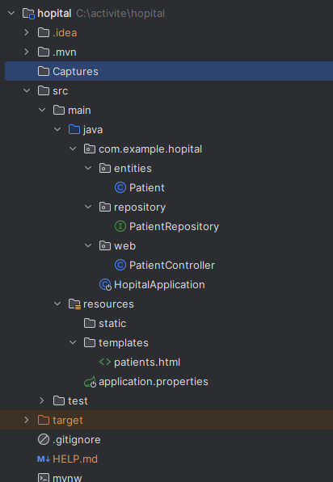
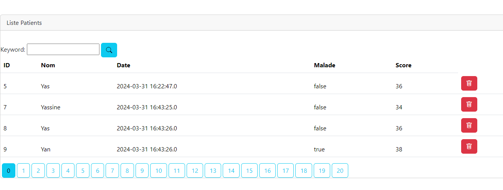
<h2>Q1:Afficher les patients</h2>
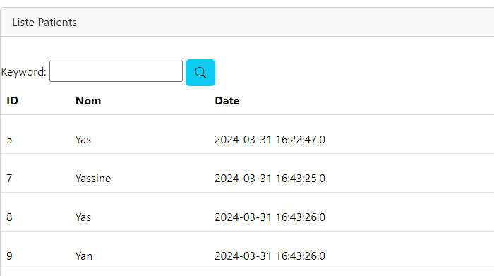
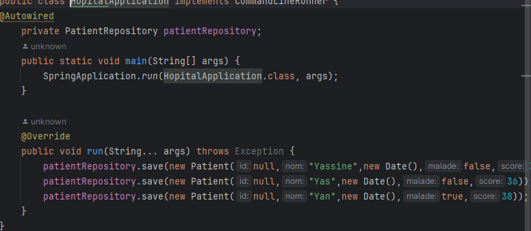
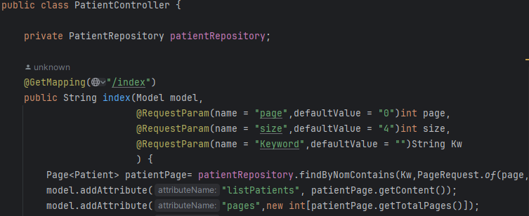
<h2>Q2:Faire la pagination</h2>
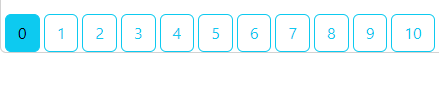
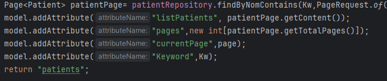
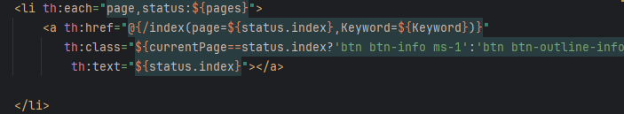
<h2> Q3:Chercher les patients</h2>

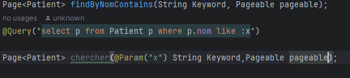
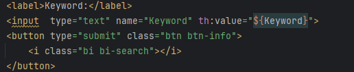
<h3> Q3:Supprimer un patient </h3>

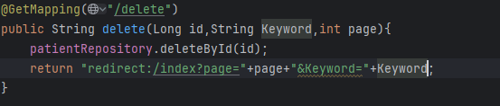
<h2>Faire des améliorations supplémentaires</h2>

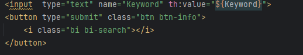
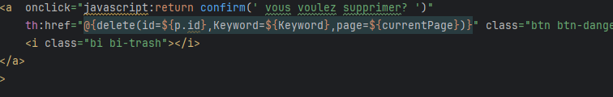

